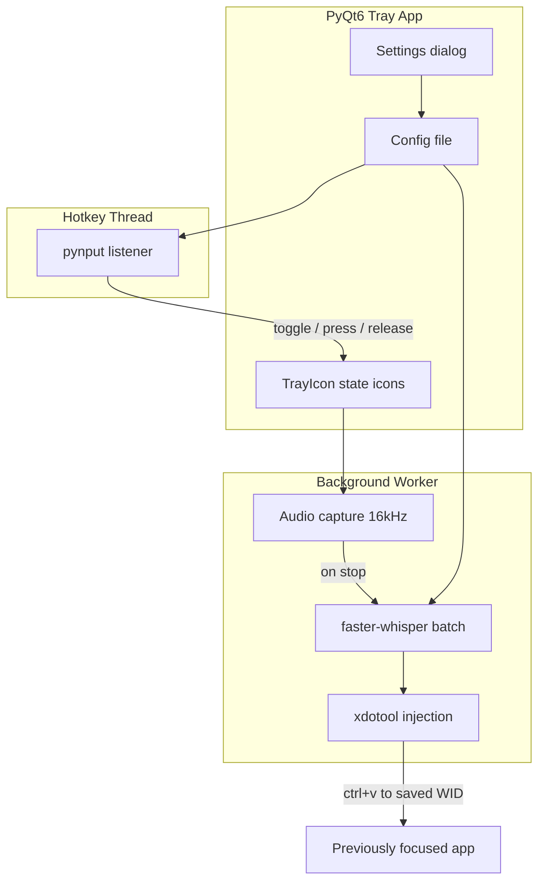

# KWhisperX — Kubuntu X11 Dictation App

## Target environment

- **OS**: Kubuntu 24.10+ (Plasma 6), **X11 session**
- **Scope**: X11 only for v1; Wayland text injection is out of scope unless added later

## Key design decisions

### Global hotkeys do not steal focus

KDE KGlobalAccel and pynput `GlobalHotKeys` listen in the background without activating the tray app. The app runs tray-only (no main window).

### Hotkey: in-app config via pynput

Hotkey is configured in tray → Settings, stored in `~/.config/kwhisperx/config.json`. KF6 Python bindings are not packaged on Kubuntu, so pynput is used instead of native KGlobalAccel.

### Text injection on X11

1. At listen start: `xdotool getwindowfocus` → save window ID
2. At listen stop: set clipboard, then `xdotool key --window $WID ctrl+v`
3. Fallbacks: terminal paste (`Ctrl+Shift+V`), keystroke typing, focus-swap pattern

### Resource efficiency

- faster-whisper embedded in-process, lazy-loaded, kept resident
- Default: `base` model, `int8` on CPU
- Batch transcribe on stop (not streaming)
- Audio capture only while listening

## Architecture



### State machine

| State | Tray icon | Behavior |
|---|---|---|
| `idle` | mic-off | Waiting for hotkey |
| `listening` | mic-on | Recording; target window ID locked |
| `processing` | hourglass | Whisper transcribing |
| `error` | warning | Failure notification |

### Hotkey modes

- **Toggle**: press once → start; press again → stop, transcribe, inject
- **Hold**: key down → start; key up → stop, transcribe, inject

## Python environment

- `.venv/` created by `setup.sh`
- `run.sh` launches `.venv/bin/python -m kwhisperx`
- System apt deps: `python3-venv`, `python3-dev`, `xdotool`, `libportaudio2`
- All Python deps installed via pip into venv

## Project layout

```
kwhisperx/
  plan.md
  agent.md
  pyproject.toml
  setup.sh
  run.sh
  README.md
  kwhisperx/
    __main__.py
    app.py
    hotkey.py
    audio.py
    transcribe.py
    inject.py
    config.py
    settings.py
    dbus_service.py
  autostart/
    kwhisperx.desktop
```

## Settings defaults

| Setting | Default |
|---|---|
| Hotkey | `Ctrl+Alt+Space` |
| Mode | Toggle |
| Whisper model | `base` |
| Compute | auto-detect CPU/GPU |
| Language | `en` |
| Injection method | auto |
| Autostart | off |

## Implementation phases

### Phase 1 — Core tray + toggle dictation
- Scaffold, venv scripts, tray app, toggle hotkey, audio + whisper, clipboard inject

### Phase 2 — Hold mode + injection robustness
- Hold-to-talk, terminal/keystroke fallbacks, hotkey recorder

### Phase 3 — Kubuntu polish
- Autostart, Breeze icons, notifications, optional D-Bus API

## Out of scope for v1

- whisper_streaming, Wayland support, PyKF6/KGlobalAccel hard dependency, separate whisper daemon
