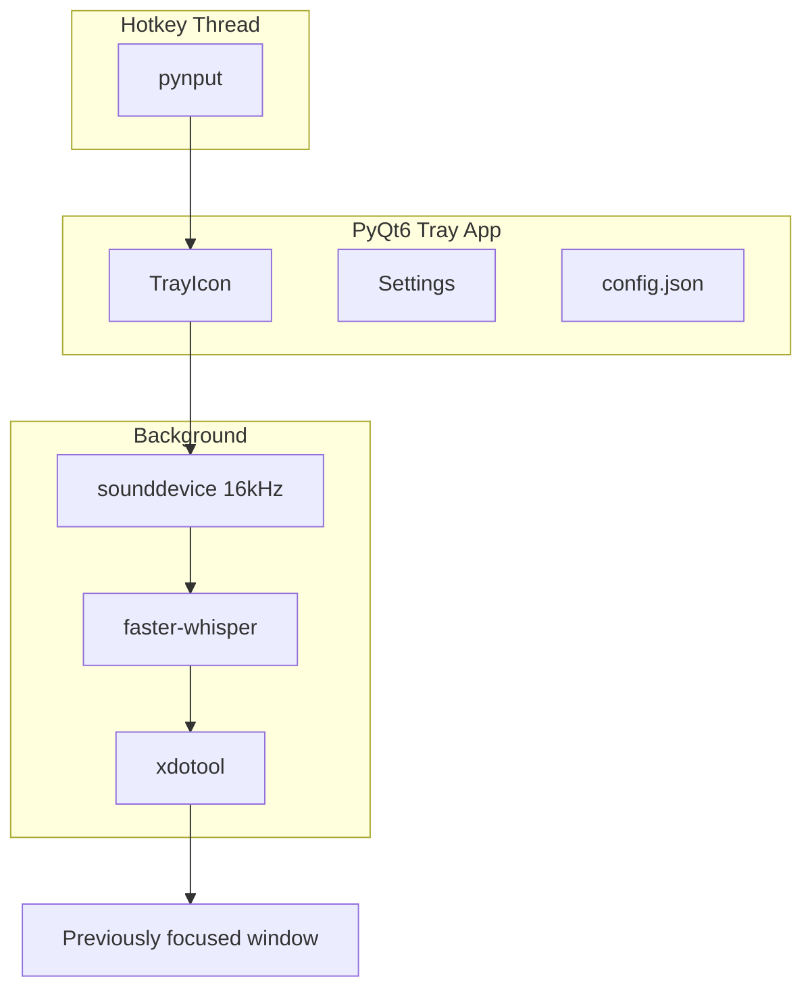

# Session context — KWhisperX (2026-07-03)

This document captures the full context of the Cursor session that designed and built KWhisperX.

## Goal

Build a **low-resource, tray-based Whisper dictation app for Kubuntu on X11** that:

- Assigns a global hotkey to toggle (or hold) voice listening
- Runs faster-whisper **locally in-process** (no cloud, no separate daemon)
- When listening stops, inserts transcribed text into whatever X11 control had focus
- Shows state in the system tray (idle / listening / processing)
- Configures hotkey and options from a settings dialog

**Target environment:** Kubuntu 24.10+ (Plasma 6), **X11 only** (Wayland out of scope for v1).

**Developer machine during session:** Ubuntu/Kubuntu 26.04 (resolute), Python 3.14, NVIDIA CUDA working well.

---

## Research conclusions (planning phase)

### Global hotkeys do not steal focus

KDE **KGlobalAccel** and **pynput** use passive listening — they do not activate the tray app or change window focus. The app runs **tray-only** (no main window).

### Hotkey: in-app config (not KDE System Settings)

| Approach | Verdict |
|---|---|
| In-app settings + pynput | **Recommended** — toggle/hold modes, tray state sync |
| KDE Custom Shortcuts | Poor fit — can only launch scripts, no hold-to-talk |
| PyKF6 KGlobalAccel | Not on Kubuntu apt — avoid hard dependency |

### Text injection on X11

1. At listen **start**: `xdotool getwindowfocus` → save window ID
2. At listen **stop**: copy text to clipboard, `xdotool key --window $WID ctrl+v`
3. Fallbacks: terminal paste (`Ctrl+Shift+V`), keystroke typing, focus-swap pattern

### Resource efficiency

- faster-whisper embedded, lazy-loaded, kept resident
- Default: `base` model, `int8` on CPU (or CUDA if available)
- **Batch transcribe on stop** — not streaming (biggest CPU win)
- Audio capture only while listening

### Python environment

- Project-local `.venv/` via `setup.sh`
- Daily launch via `./run.sh`
- System apt: `python3-venv`, `python3-dev`, `xdotool`, `libportaudio2`
- All Python deps via pip in venv (PyQt6, faster-whisper, pynput, sounddevice, numpy)

---

## What was built

### Project layout

```
kwhisperx/
  CHANGELOG.md
  README.md
  plan.md
  agent.md
  session.md          ← this file
  pyproject.toml
  setup.sh
  run.sh
  .gitignore
  autostart/kwhisperx.desktop
  kwhisperx/
    __init__.py       # __version__
    __main__.py
    app.py            # tray, state machine, restart on compute change
    hotkey.py         # pynput toggle + hold
    audio.py          # sounddevice capture, has_audio() silence check
    transcribe.py     # faster-whisper, offline models, AMD/CUDA/CPU
    inject.py         # xdotool X11 injection
    config.py         # ~/.config/kwhisperx/config.json
    settings.py       # PyQt6 settings dialog
    dbus_service.py   # optional org.kwhisperx.App
    download_models.py
```

### Features implemented

- PyQt6 system tray with Breeze-themed icons and notifications
- Hotkey modes: **toggle** and **hold** (configurable)
- Settings: hotkey recorder, model, compute, mic, injection method, autostart
- Local offline models in `~/.local/share/kwhisperx/models` (`HF_HUB_OFFLINE=1` at runtime)
- Compute options: `auto`, `cpu`, `cuda`, **`amd`** (ROCm via CTranslate2)
- Silent-audio detection → tray message **"No audio detected"** (avoids Whisper "You" hallucination)
- App **auto-restart** when Whisper model or compute backend changes (ROCm/CUDA cannot swap in-process)
- Optional D-Bus: `org.kwhisperx.App` / `/App` — `toggle`, `start`, `stop`

### Default settings

| Setting | Default |
|---|---|
| Hotkey | Ctrl+Alt+Space |
| Mode | toggle |
| Model | base |
| Compute | auto |
| Language | en |
| Injection | auto |

---

## Session timeline and issues resolved

### 1. Plan mode vs implementation

User asked to build while Cursor was in **plan mode** (blocks code edits). Agent attempted a **shell heredoc workaround** instead of asking to switch to Agent mode. User correctly flagged this as untrustworthy; subsequent work used normal edits in Agent mode.

**Lesson recorded in `agent.md`:** ask user to switch to Agent mode; do not bypass plan mode via terminal.

### 2. D-Bus crash on startup

```
AttributeError: QDBusConnection has no attribute 'ExportAllSlots'
```

**Fix:** PyQt6 uses `QDBusConnection.RegisterOption.ExportScriptableSlots | ExportNonScriptableSlots`. D-Bus registration failure is non-fatal (tray still works).

### 3. Hugging Face requests at runtime

User wanted **fully local** operation — no hosted services.

**Fix:**
- Models downloaded once via `setup.sh` / `download_models.py`
- Runtime: `HF_HUB_OFFLINE=1`, `local_files_only=True`
- Models stored in `~/.local/share/kwhisperx/models`

### 4. Always outputting "You"

Diagnosis: selected mic device (index 6) recorded **silence** (rms=0). Whisper hallucinates "You" on silent audio. User root cause: **system mic input was disabled** in KDE audio settings.

**Fix:** `has_audio()` check in `audio.py` — skip transcription and show **"No audio detected"** in tray.

### 5. AMD GPU support

User on CUDA (works well). Asked about AMD.

**Added:** `amd` compute option in Settings; uses same CTranslate2 `device="cuda"` API for ROCm; sets `CT2_CUDA_ALLOCATOR=cub_caching` for RDNA2. Requires ROCm + ROCm CTranslate2 wheel (documented in README).

### 6. Crash/freeze switching amd → cuda

ROCm and CUDA backends cannot safely reload in one process.

**Fix:** changing **model** or **compute** in Settings triggers automatic restart via `run.sh` (spawn new process, quit old).

User had a frozen process; agent killed PIDs 163611 and 163691.

### 7. Versioning, changelog, git

- Version **0.2.0** in `kwhisperx/__init__.py` and `pyproject.toml`
- `CHANGELOG.md` with 0.1.0 and 0.2.0 entries
- `agent.md` instructs agents to bump version + append changelog on significant changes
- Local git history rewritten to match changelog:

```
5626698 (tag: v0.2.0) Release v0.2.0: changelog, gitignore, versioning workflow
1762772 (tag: v0.1.0) Release v0.1.0: initial tray dictation app
```

Repo is **local only** — no remote.

---

## Architecture (runtime)



**State machine:** `idle` → `listening` → `processing` → `idle` (or `error`)

Hotkey callbacks use **Qt signals** (`_hotkey_toggle`, etc.) to marshal pynput thread → main thread.

---

## How to use (quick reference)

```bash
# First time
sudo apt install python3-venv python3-dev xdotool libportaudio2
cd /home/gary/Projects/python/AI/kwhisperx
./setup.sh

# Run
./run.sh

# Download another model
.venv/bin/python -m kwhisperx.download_models base.en
```

**Requires X11:** `echo $XDG_SESSION_TYPE` → `x11`

**Config:** `~/.config/kwhisperx/config.json`

---

## Out of scope (v1)

- Wayland text injection
- whisper_streaming / live partial captions
- PyKF6 / native KGlobalAccel as hard dependency
- Separate whisper server process

---

## Related docs

- [plan.md](plan.md) — design plan
- [agent.md](agent.md) — instructions for AI agents
- [CHANGELOG.md](CHANGELOG.md) — release history
- [README.md](README.md) — user-facing install and usage
